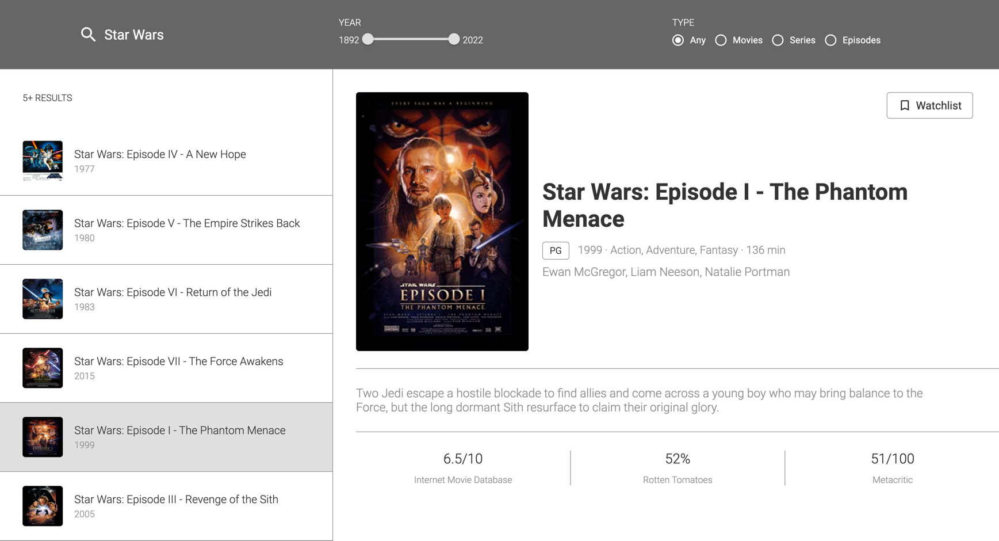
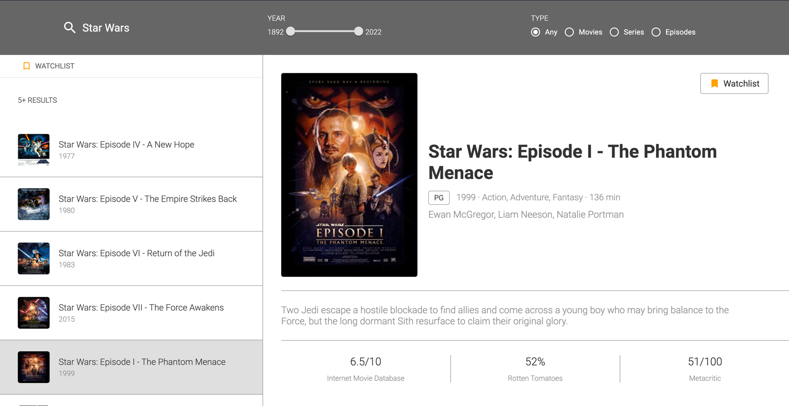
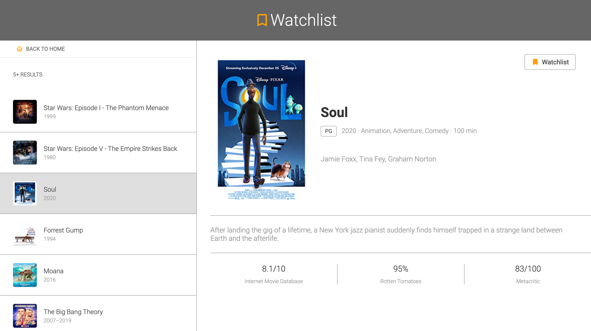

# Movie Search App

This application is using an [OMDb API](https://www.omdbapi.com/) (a RESTful web service to obtain movie information).

### To run the project on you computer, please complete next steps

1. Clone this repository (retminal):

#### `git clone https://github.com/olimstv/omdb-movie-search.git`
2. Install all dependencies:
#### `npm install`

3. Runs the app:
#### `npm start`

4. Open [http://localhost:3000](http://localhost:3000) to view it in your browser.

The page will reload when you make changes.

## Main functionality
Using this application user can search movies, Series or Episodes of the TV Shows and bookmark them.

There are 2 filters implemented in the app:
1. Year -> filters the search by a time-span. The range is from 1892 (looks like this is the oldest movie in the imdb website) to current year (2022).
2. Type -> "Any", "Movies", "Series", "Episodes"

By typing a search word and pressing enter user starts the search. Once all results received from the database, they appears in the list of movies on the left-hand side of the screen.\
After user clicking each movie, the detailed information about selected movie appears on the main section.

### Saving selected movies to the watchlist.
By pressing "Watchlist" button on the right top part of the main section, user can bookmark selected by adding it to the "watchlist" section of the application.\

As soon as at least one movie "bookmarked", "watchlist" button appears under the list of movies. Pressing "watchlist" button redirects user to the "watchlist" section.

## Is there anything after the MVP?
I found this project very interesting and challenging to work on. I learn a lot while building the app. I want to continue working on it. 
The current implementation of the app can be improved in many ways. Next steps:
1. Adding responsiveness
2. Refactoring css (possibly using 'styled components')
3. Refactoring the logic and adding some additional features (such as choosing 'ascending' or 'descending' order of displaying the movies in the list based on yea)
4. Building back-end (possibly using MERN stack) with the basic login functionality.
